<!-- <div align="center">  -->

<p align="center"></p>

<!-- <p>A flickr Clone</p> -->

---

## 🔎 Contents

<!-- - [Features](https://github.com/elizawimberly/flickr_group_project/new/main?readme=1#features)
- [Download](https://github.com/elizawimberly/flickr_group_project/new/main?readme=1#download)
- [Upcoming](https://github.com/elizawimberly/flickr_group_project/new/main?readme=1#upcoming)
- [Tech Stack](https://github.com/elizawimberly/flickr_group_project/new/main?readme=1#tech-stack)
- [Demo](https://github.com/elizawimberly/flickr_group_project/new/main?readme=1#demo)
- [Connect](https://github.com/elizawimberly/flickr_group_project/new/main?readme=1#connect) -->

- Features
- Download
- Upcoming
- Tech Stack
- Demo
- Connect

---

## 📸 Features

---

### Splash Page and User

---

When first landing on Flare at the home page the user sees a carousel of images with the option to click on an Explore button in the middle of the page or the other options to login or sign up accessed by clicking on icons on the top right navigation bar.

---

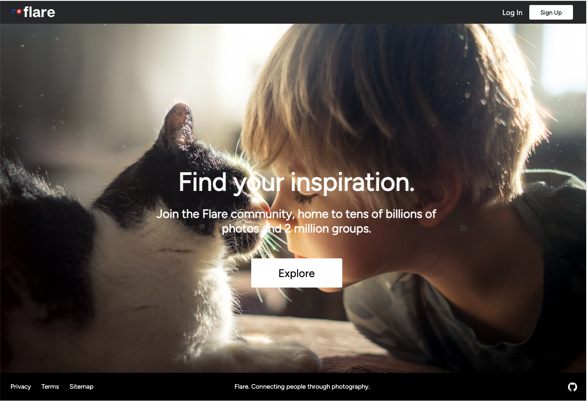

---

If the user selects sign up, they are directed to a sign up form. Alternately, if the user selects log in, the user can log in as a returning user or chose an option to log in as a demo user.

---

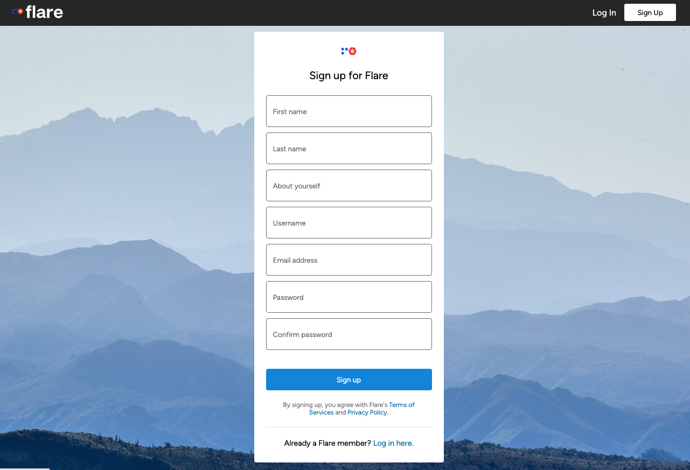

---

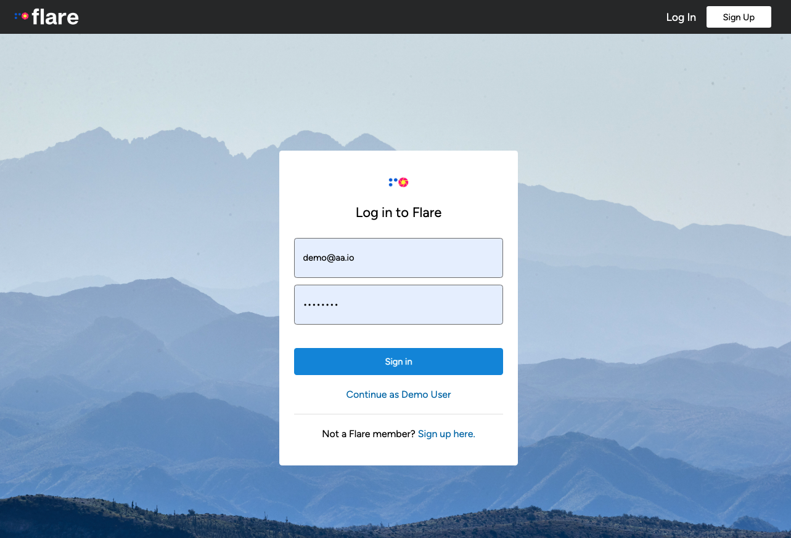

---

### Photos

---

If the user selects the explore option from the landing page, they are directed to a feed of all the photos in the Flare library. This allows us to feature the interactive photography element of the app.

---

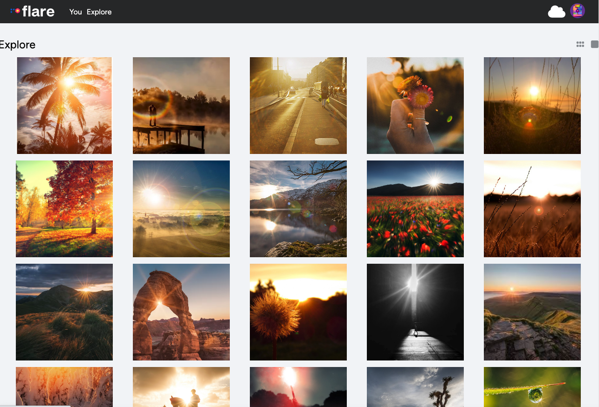

---

When a logged in user wants to interact with their own uploaded photography collection, they can access their unique user photostream page by clicking the 'You' option at the top left of the navigation bar and selecting photostream from the drop down menu.

---

---

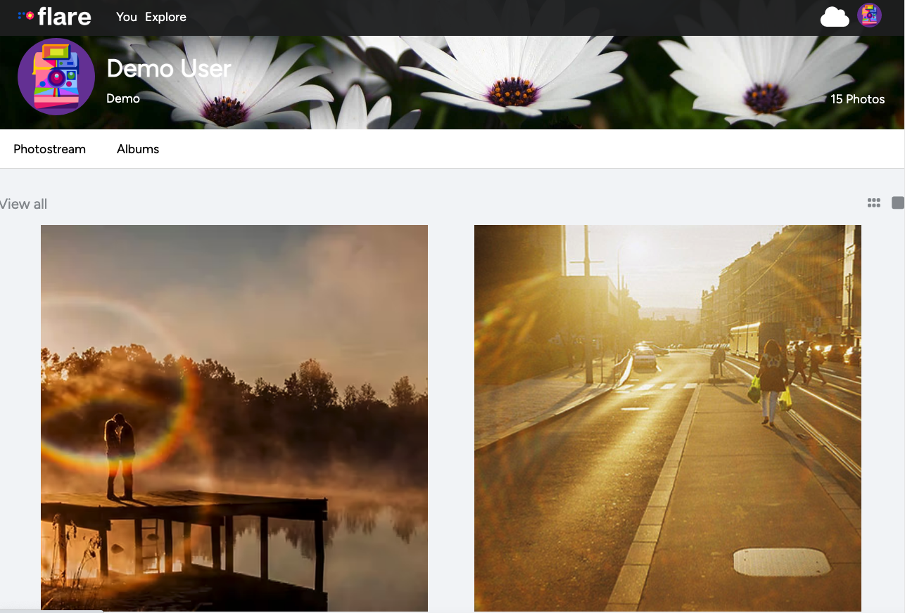

---

When a user wants to upload their own photography, while logged in there is cloud icon displayed in the upper right navigation bar. When a user selects this cloud icon they are directed to a photo upload form where they enter basic information related to their photo along with the url or the image and will allow them to post a photo.

---

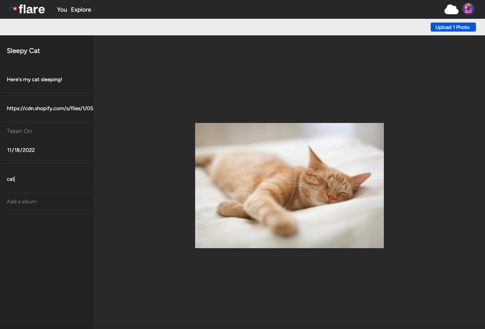

---

Once a user submits their photo information successfully, they are redirected to a photo details page that will feature the photo they have upload.

---

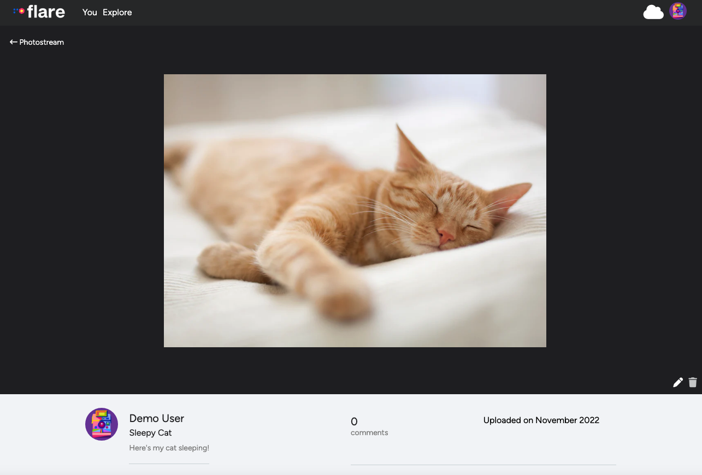

---

If a user now navigates back to their photostream page they will see their uploaded photo as part of the stream

---

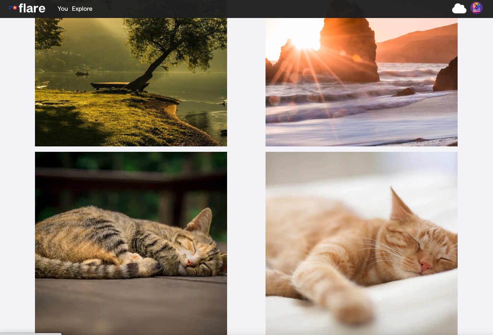

---

### Albums

---

Users can also interact and feature their photography inside collections of albums.
When a logged in user wants to create an album with their own uploaded photography collection, they can access their unique user albumstream page by clicking the 'You' option at the top left of the navigation bar and selecting albumstream from the drop down menu.

---

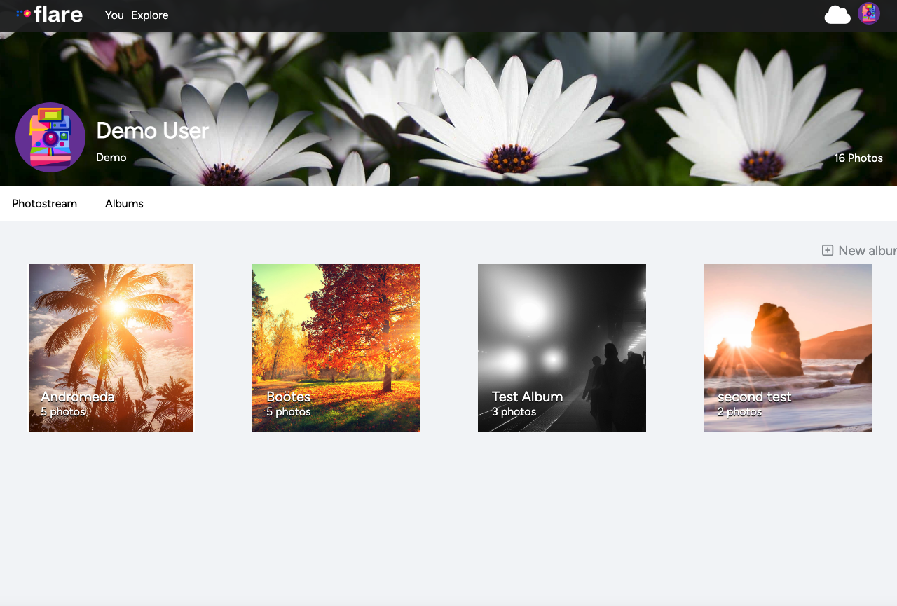

---

If a user wants to create a new album they can click the create album option to be directed to a new album form. Here there will be a list of all photos belonging to a user that are not already included in an album, and a user can select all photos they want to add, they submit to create a new album

---

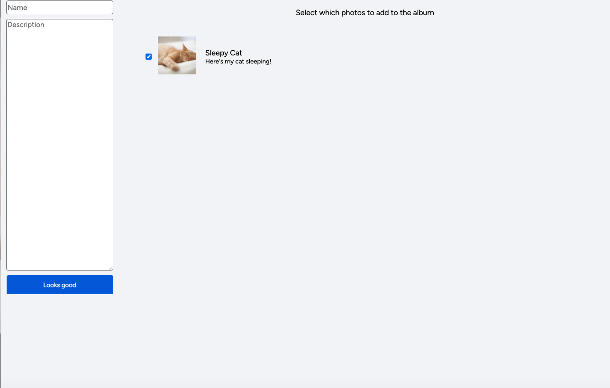

---

### Comments

---

A user can read comments that are added for a specific photo on the photo detail page. A logged in user is given the option to add their own comment or delete previous comments they have left.

---

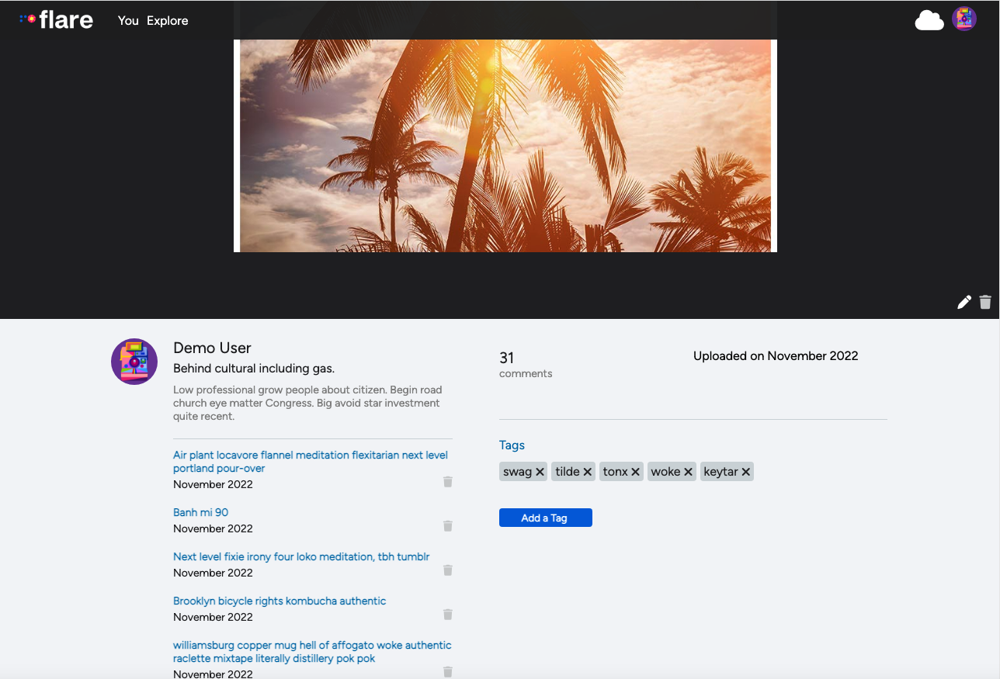
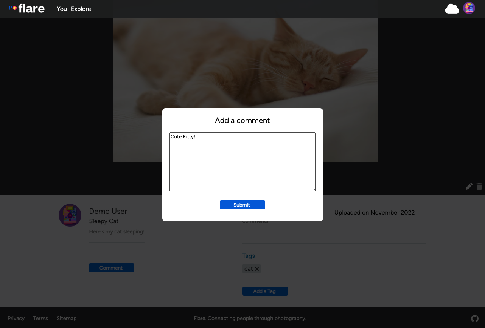

---

### Tags

---

A user can read tags that are added for a specific photo on the photo detail page. If the photo belongs to the logged in user, the user is given the option to delete tags.

---

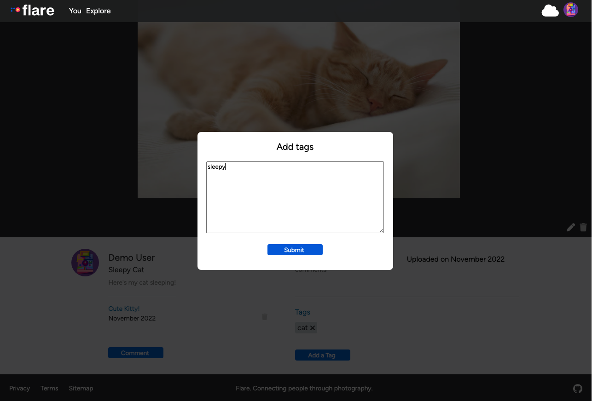

---

## 📁 Download

- Clone this repository

- Install dependencies

  ```bash
  pipenv install -r requirements.txt
  ```

- Create a **.env** file based on the example with proper settings for your
  development environment

- Make sure the SQLite3 database connection URL is in the **.env** file

- This starter organizes all tables inside the `flask_schema` schema, defined
  by the `SCHEMA` environment variable. Replace the value for
  `SCHEMA` with a unique name, **making sure you use the snake_case
  convention**.

- Get into your pipenv, migrate your database, seed your database, and run your Flask app

  ```bash
  pipenv shell
  ```

  ```bash
  flask db upgrade
  ```

  ```bash
  flask seed all
  ```

  ```bash
  flask run
  ```

- cd into the react-app directory and install dependancies

  ```
  npm install
  ```

- then run your react front end and your browser should automatically open the app on http://localhost:3000/

  ```
  npm start
  ```

---

## ⏱ Upcoming

Upcoming features will include the ability to edit comments and tags features so that we will implement full crud on 4 features of our app!

---

## 📚 Tech Stack

### Framework:

<p>
<a href="https://www.javascript.com/"></a>
<a href="https://nodejs.org/en/"></a>
<a href="https://www.python.org/"></a>
<a href="https://html.spec.whatwg.org/"></a>
<a href="https://www.w3.org/TR/CSS/#css"></a>
<br>

### Frontend:

<p>
<a href="https://reactjs.org/"></a>
<a href="https://redux.js.org/"></a>
<br>

### Backend:

<p>
<a href="https://sqlite.org/index.html"></a>
<a href="https://sequelize.org/"></a>
<a href="https://flask.palletsprojects.com/en/2.2.x/"></a>
<a href="https://expressjs.com/"></a>
<a href="https://www.postgresql.org/"></a>
<br>

<!-- ---

<!-- ## 🖱 Demo

Check out flare for yourself. Click the icon below to be redirected to Render, the current hosting site for the fullstack API: -->

<!-- <p>
<a href="https://dashboard.render.com/"></a> -->

---

## 🤝 Connect

This API was brought to you by

<p align="center">
  <a href="https://www.linkedin.com/in/eliza-wimberly-773896205/"></a>
  <a href="https://www.linkedin.com/in/justin-rife-730875181/"></a>
  <a href="https://www.linkedin.com/in/kevinlongboy/"></a>
  <a href="https://www.linkedin.com/in/yasamine-cruz-7b6867256/"></a>
</p>

<!-- </div> -->
